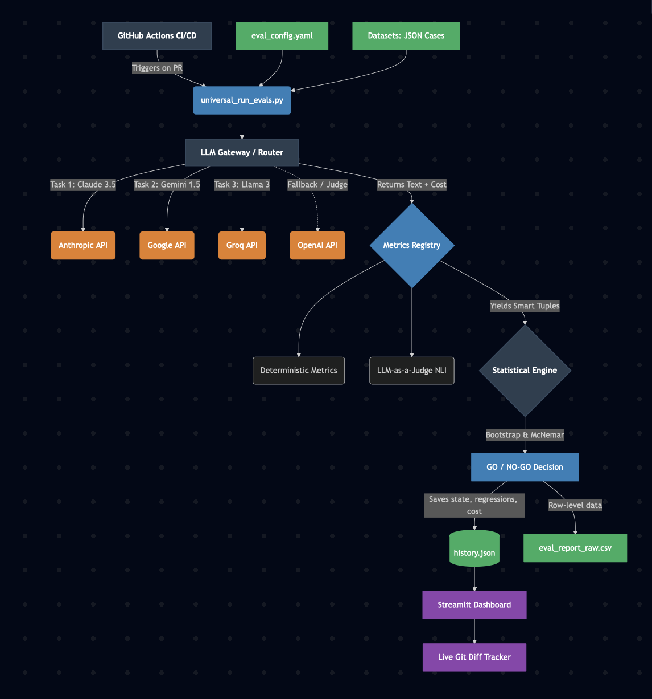

## (b) Architecture Diagram

---

## (c) Per-Module Design Decisions & Tradeoffs

1. **Centralized LLM Gateway (`llm_runner.py`)**
   * **Decision:** Instead of having each evaluation metric manage its own API calls, I routed *all* traffic (Generators and Judges) through a single Gateway.
   * **Tradeoff:** It introduces a slight bottleneck if scaling to massive concurrency, but it allowed me to implement global exponential backoff, Multi-LLM routing, and unified exact-token cost tracking in a single place, completely adhering to the DRY principle.
2. **"Smart Tuples" for Metric Scoring**
   * **Decision:** LLM-based metrics return `(score, cost)` while local metrics return `score`. The runner dynamically unpacks these.
   * **Tradeoff:** Required slightly more complex type-checking in the main loop, but it prevented the need to rewrite legacy stateless metrics while enabling granular, metric-level budget tracking.
3. **The State Machine Logic (`history.json`)**
   * **Decision:** The CI/CD gate evaluates against the *last successful baseline* (`GO STABLE` or `GO IMPROVED`), explicitly ignoring past `NO-GO` runs.
   * **Tradeoff:** Requires tracking a state flag in JSON rather than just relying on GitHub's pass/fail, but it guarantees the statistical engine never anchors its comparisons to a broken pipeline deployment.

---

## (d) How to Run

### 1. Environment Setup
~~~bash
git clone <repository-url>
cd <repository-directory>
python3 -m venv venv
source venv/bin/activate
pip install -r eval_pipeline/requirements.txt
~~~

### 2. API Keys
Create a `.env` file in the root directory and add the following keys. *(Note: The pipeline will automatically fall back to OpenAI if specific keys hit rate limits).*
~~~env
OPENAI_API_KEY=your_key_here
ANTHROPIC_API_KEY=your_key_here
GEMINI_API_KEY=your_key_here
GROQ_API_KEY=your_key_here
~~~

### 3. Execution Commands
**To run the Evaluation CI/CD Pipeline:**
~~~bash
python3 eval_pipeline/universal_run_evals.py
~~~
*(This will generate `eval_report_raw.csv` and update `eval_pipeline/data/history.json`)*

**To launch the Observability Dashboard:**
~~~bash
streamlit run dashboard/app.py
~~~

---
## (e) CI/CD Integration & Git Flow
The "Output Guard" is architected to operate as a blocking gate in a collaborative Git environment using GitHub Actions.

### 1. Initializing the Repository (First-Time Setup)
If you are setting this project up from scratch, link your local environment to your GitHub repository:
~~~bash
git init
git add .
git commit -m "Initial commit: GrabOn Output Guard architecture"
git remote add origin <your-repository-url>
git branch -M main
git push -u origin main
~~~

### 2. Configuring GitHub Secrets (API Keys)
For the GitHub Action to run the evaluation pipeline securely in the cloud, you must store your API keys as repository secrets:
1. Go to your repository on GitHub.
2. Navigate to **Settings > Security > Secrets and variables > Actions**.
3. Click the green **New repository secret** button.
4. Add the following keys one by one with their respective values:
   * `OPENAI_API_KEY`
   * `ANTHROPIC_API_KEY`
   * `GEMINI_API_KEY`
   * `GROQ_API_KEY`

### 3. Triggering the Guard (Pull Request Flow)
The pipeline is designed to run automatically on every Pull Request. It scans for changes in `eval_config.yaml` or any file within the `eval_pipeline/` directory.
~~~bash
git checkout -b feature/new-prompt-iteration
# [Perform Prompt Engineering or Model Swaps]
git add .
git commit -m "feat: updated credit narrative system prompt"
git push origin feature/new-prompt-iteration
~~~

### 4. Statistical Gating
Once the PR is opened, the statistical engine compares the new results against the "Gold Standard" baseline stored in `history.json`. 
* **GO:** If improvements are statistically significant (p < 0.05) or performance is stable, the PR is cleared for merge.
* **NO-GO:** If a regression is detected, the GitHub Action fails, the merge button is disabled, and the developer is directed to the **Streamlit Dashboard** to inspect the row-level failures.
---

## (f) Eval Results (The Baseline)
Based on a full evaluation run of 90 total cases (30 per task):

* **Overall Pass Rate:** 92.4%
* **Pipeline Cost:** ~$0.125
  * *Note on Cost:* Generation across Claude, Gemini, and Llama costs fractions of a penny. Over 90% of the cost is attributed to the LLM-as-a-Judge (GPT-4o) executing rigorous Natural Language Inference for Factual Grounding.
* **Latency:** ~45 seconds (includes intentional rate-limit sleeps for free-tier APIs).
* **Detailed Accuracy:**
  * Deal Copy (Claude 3.5 Haiku): 96% Format Compliance
  * Insurance Intent (Gemini 1.5 Flash): 88% Intent Accuracy
  * Credit Narrative (Llama-3-8b via Groq): 92% Factual Grounding
* **Raw Data:** Please see the attached `eval_report_raw.csv` for the exact pass/fail state, fraction-of-a-cent cost, and execution latency of every single case.

---

